# SearXNG 本地部署与配置

CherryStudio 支持通过 SearXNG 进行网络搜索，SearXNG 是一个可本地部署的开源项目，所以与其他需要 API 提供商的配置方式略有不同。

**SearXNG 项目链接**：[SearXNG](https://github.com/searxng/searxng)

## SearXNG 的优势：

* 开源免费，无需 API
* 隐私性相对较高
* 可高度定制化

## 本地部署

SearXNG 的部署方式既可以通过服务器部署也可以进行本地部署，为方便使用，本文档以最简单快捷的本地部署为例以满足最低使用门槛需求。

### 一、Docker 直接部署

由于 SearXNG 不需要复杂的环境配置，可以不用 docker compose，只需要简单提供一个空闲端口即可部署，所以最快捷的方式可以使用 Docker 直接拉取镜像进行部署。

#### 1. 下载安装并配置 [docker](https://www.docker.com/)

<figure></figure>

安装后选择一个镜像存储路径：

<figure>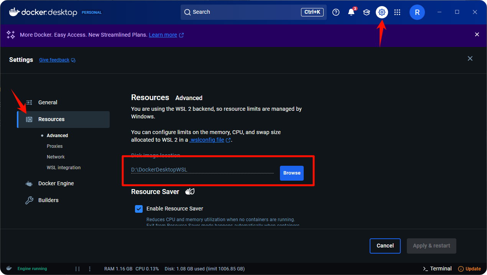</figure>

#### 2. 搜索并拉取 SearXNG 镜像

搜索栏输入 **searxng** ：

<figure>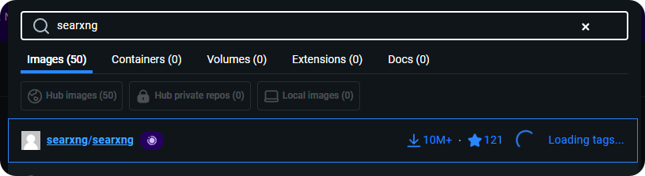</figure>

拉取镜像：

<figure>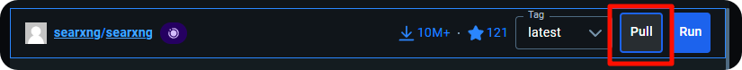</figure>
<figure>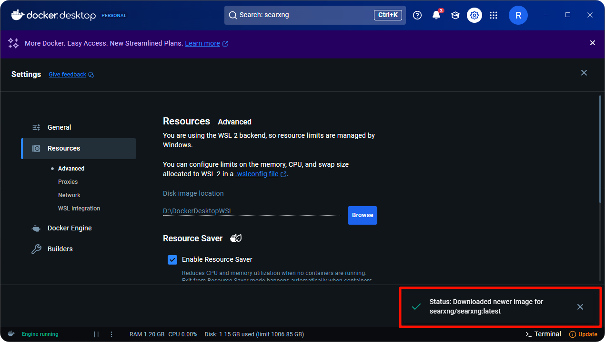</figure>

#### 3. 运行镜像

拉取成功后来到 **images** 页面：

<figure>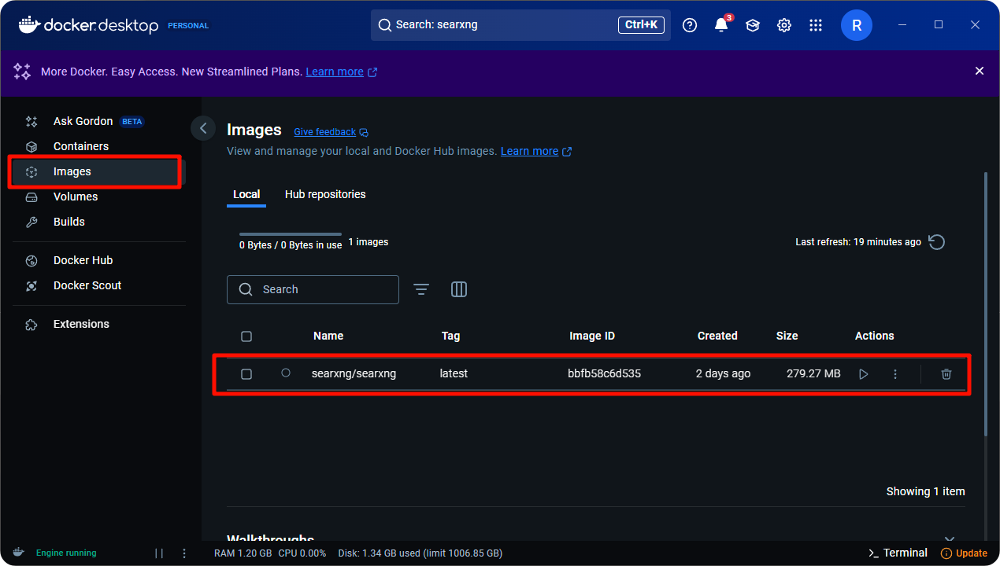</figure>

选择拉取的镜像点击运行：

<figure>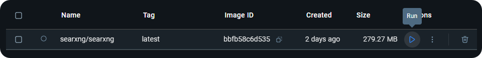</figure>

打开设置项进行配置：

<figure>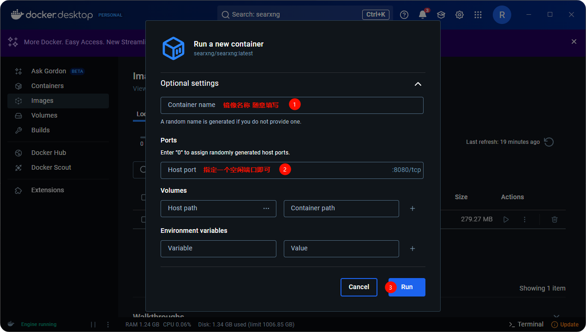</figure>

以 `8085` 端口为例：

<figure>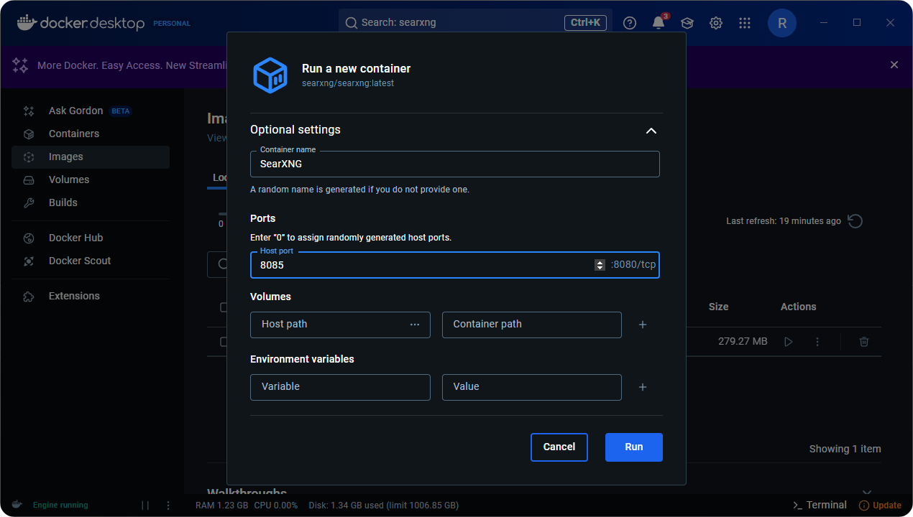</figure>

运行成功后点击链接即可打开 SearXNG 的前端界面：

<figure>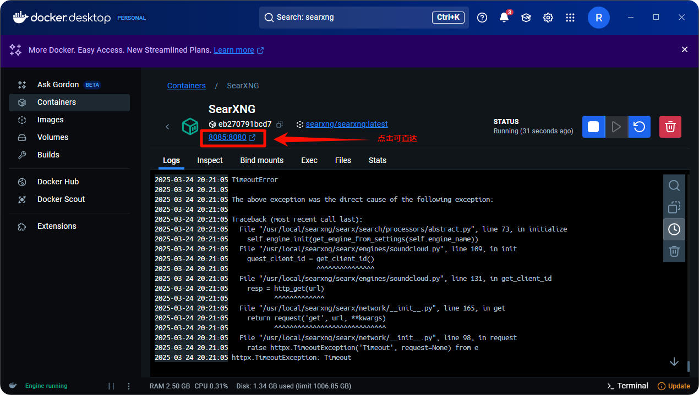</figure>

出现这个页面说明部署成功：

<figure>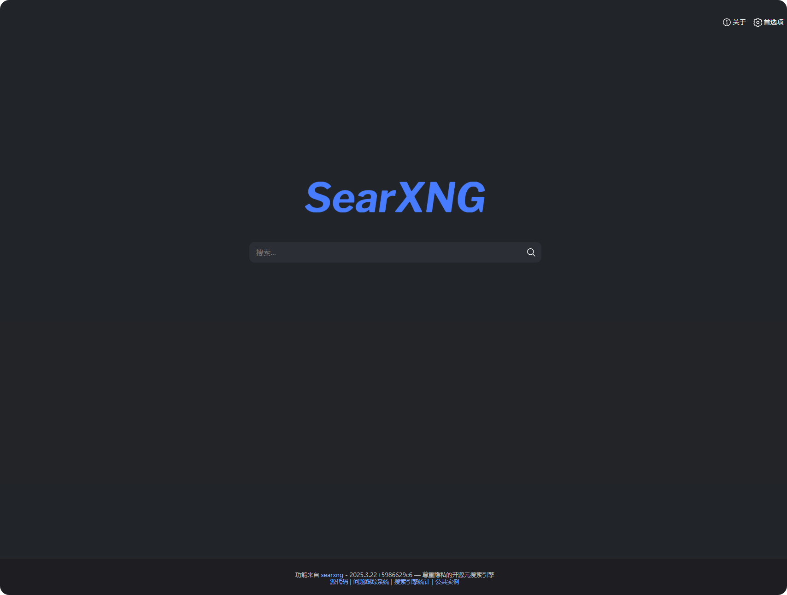</figure>

### Cherry Studio 相关配置

SearXNG 本地部署成功，接下来是 CherryStudio 的相关配置。

来到网络搜索设置页面，选择 Searxng ：

<figure>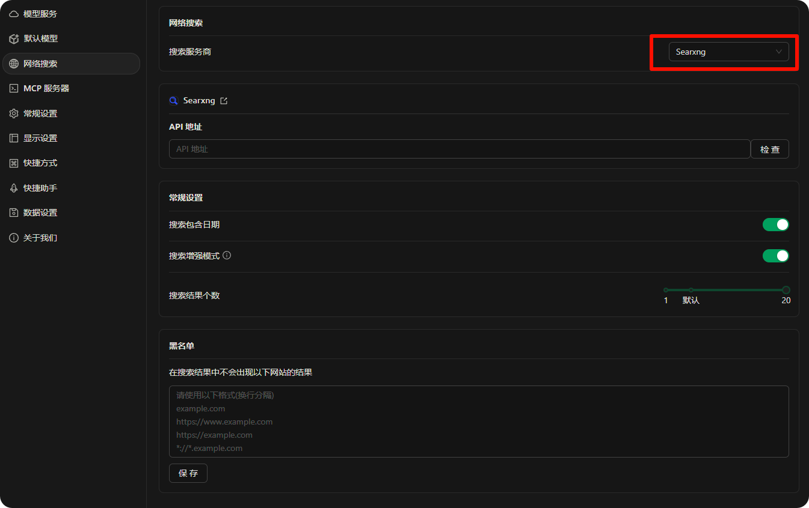</figure>

直接输入本地部署的链接发现验证失败，此时不用担心：

<figure>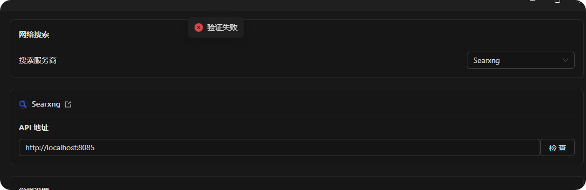</figure>

因为直接部署后默认并没有配置 json 返回类型，所以无法获取数据，需要修改配置文件。

回到 Docker，来到 Files 标签页找到镜像中找到带标签的文件夹：

<figure>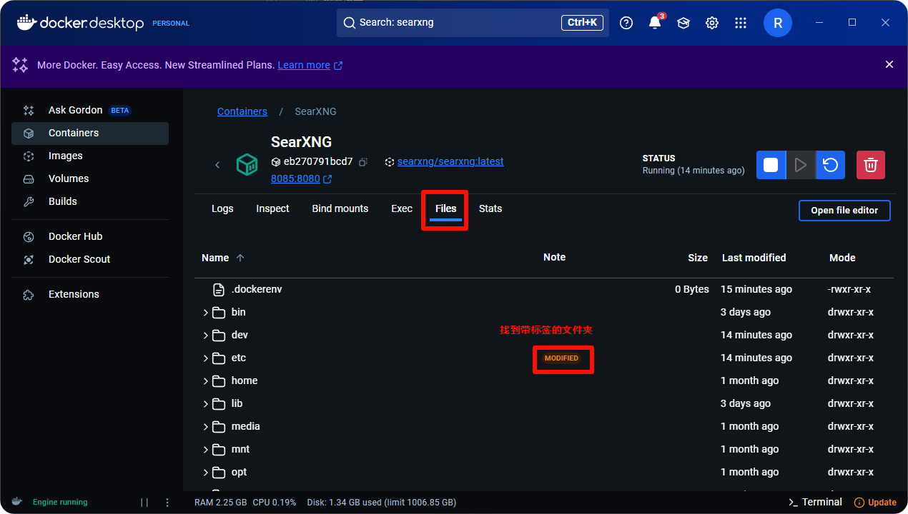</figure>

展开后继续往下翻，会发现另一个带标签的文件夹：

<figure>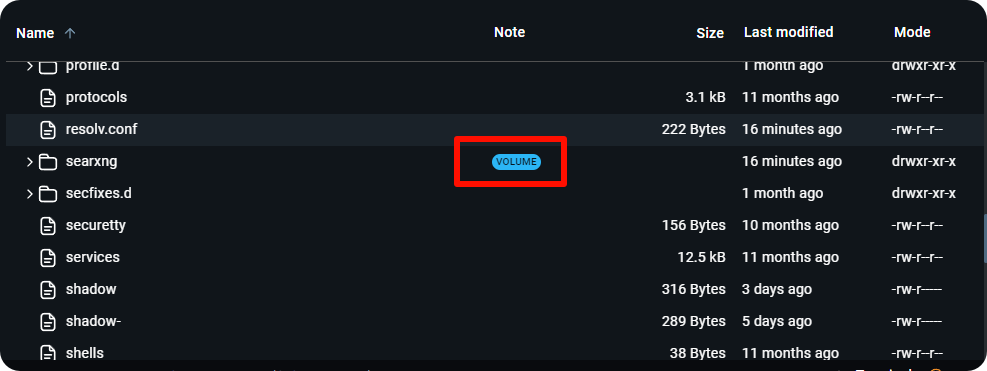</figure>

继续展开，找到 **settings.yml** 配置文件：

<figure></figure>

点击打开文件编辑器：

<figure>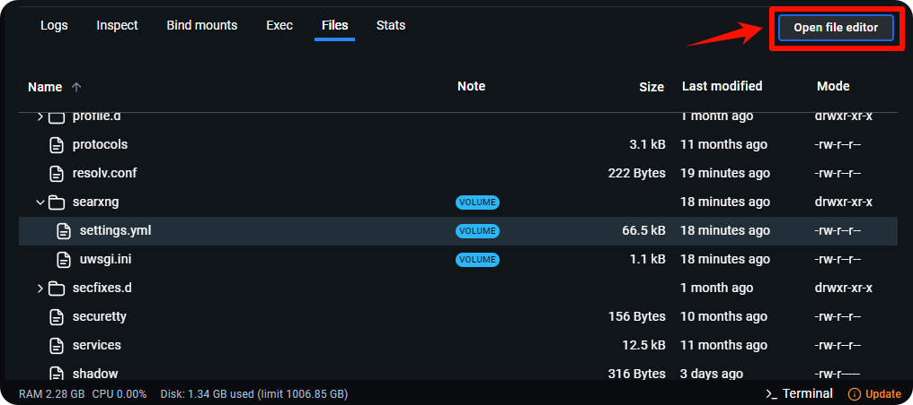</figure>

找到 78 行，可以看到类型只有一个 html

<figure>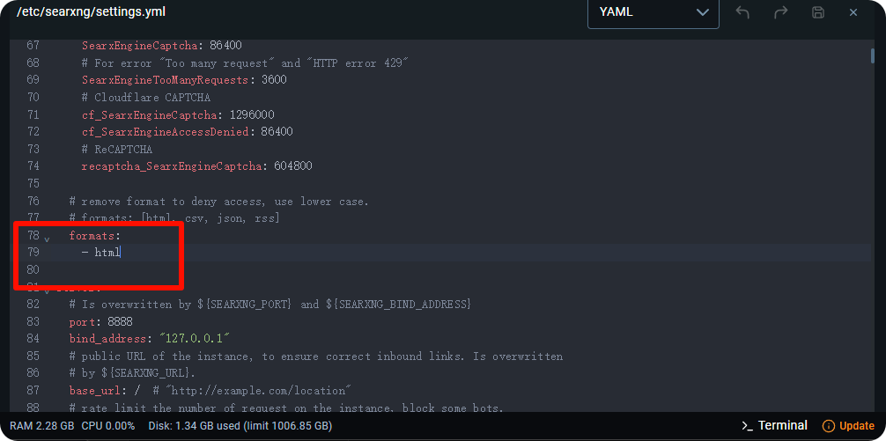</figure>

添加 json 类型后保存，重新运行镜像

<figure>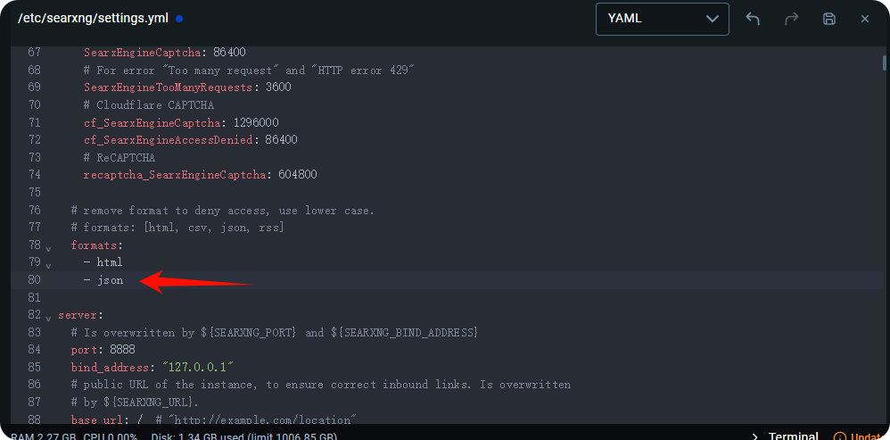</figure>
<figure>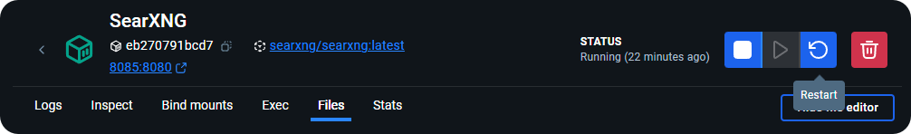</figure>

重新回到 Cherry Studio 进行验证，验证成功：

<figure>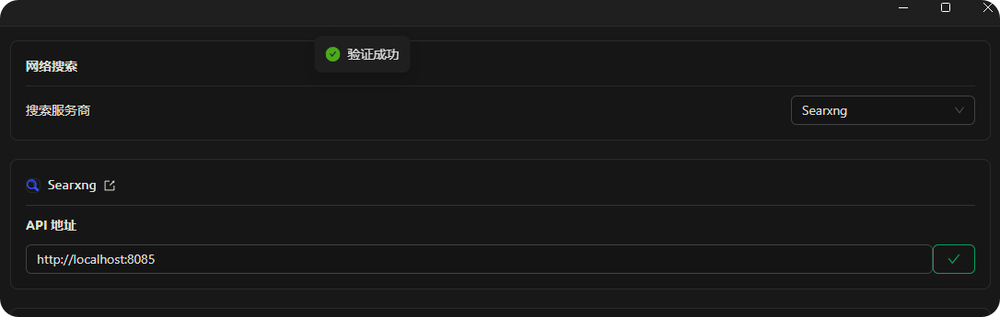</figure>

地址既可以填写本地： <http://localhost> : 端口号
也可以填写 docker 地址：<http://host.docker.internal> : 端口号

### 其他配置

此时 SearXNG 已具备默认联网搜索能力，如需定制搜索引擎需要自行进行配置

需要注意的是此处首选项并不能影响大模型调用时的配置

<figure>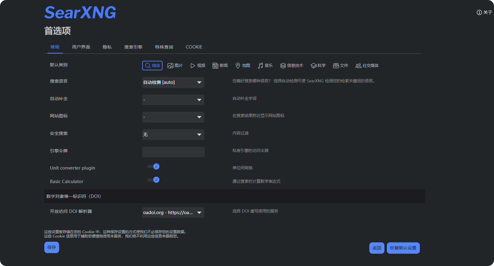</figure>

如需配置需要大模型调用的搜索引擎，需在配置文件中设置：

<figure>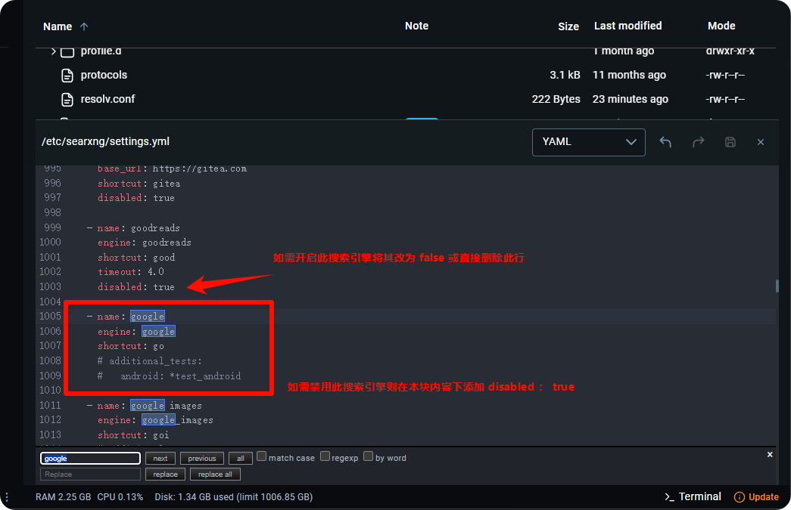</figure>
<figure>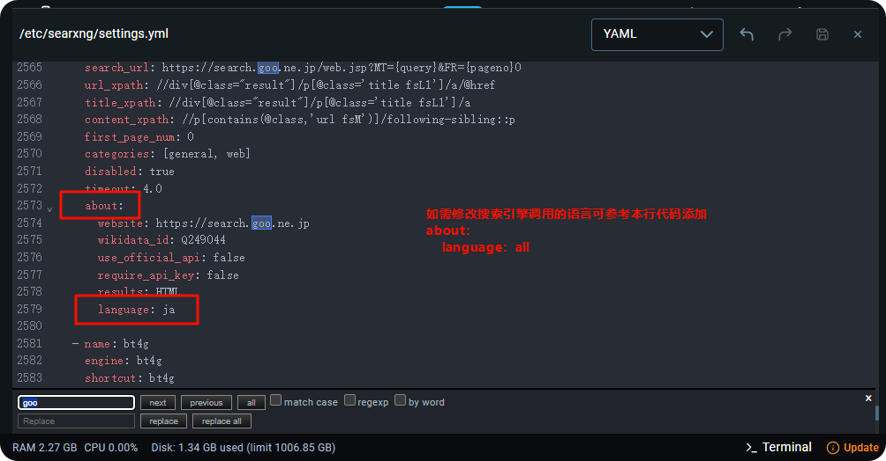</figure>

配置语言参考：

<figure>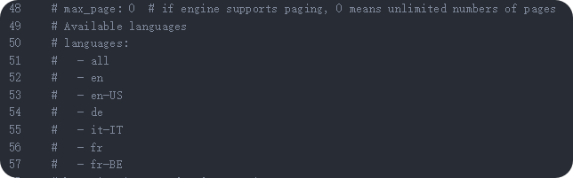</figure>

若内容太长直接修改不方便，可将其复制到本地 IDE 中，修改后粘贴到配置文件中即可。