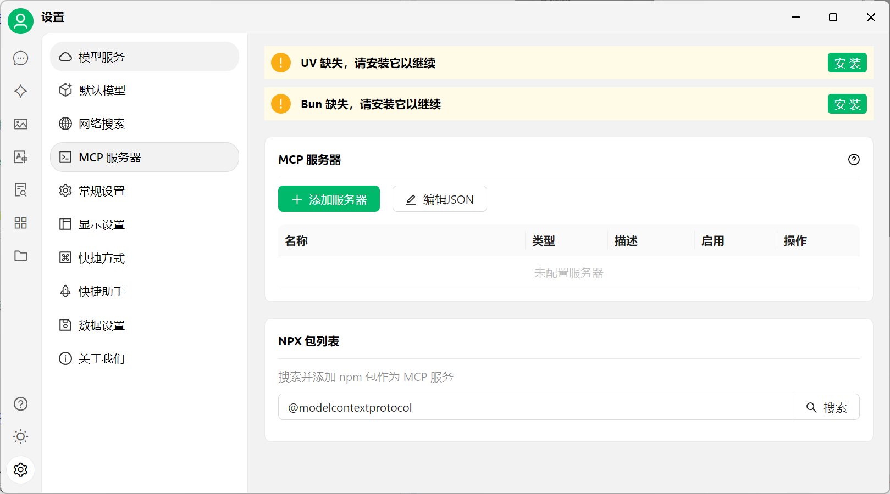
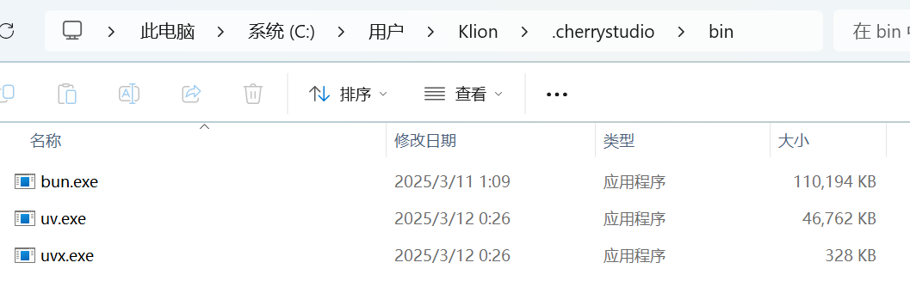
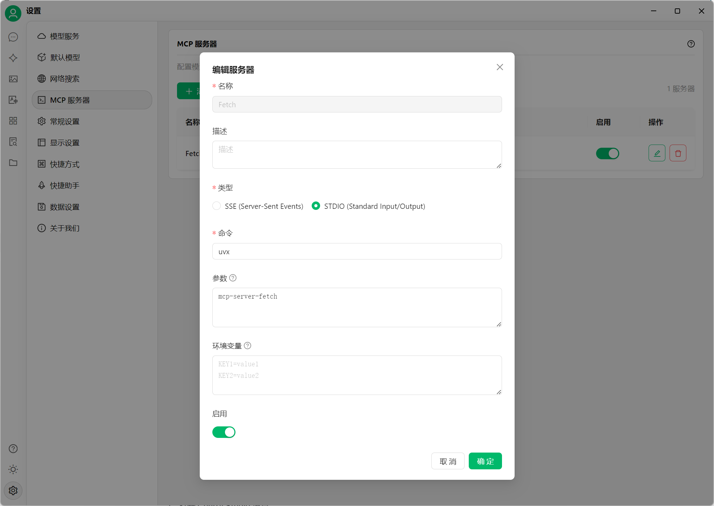
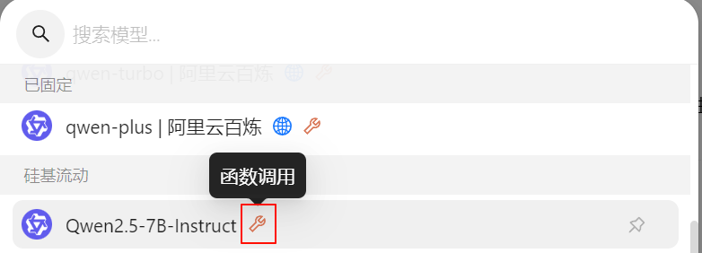
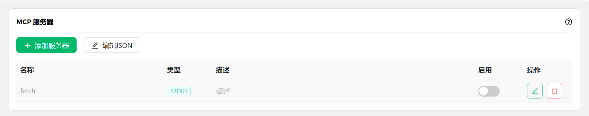

# MCP 使用教程

**MCP(Model Context Protocol)** 是一种开源协议，旨在以标准化的方式向大语言模型（LLM）提供上下文信息。更多关于 MCP 的介绍请见 [#shen-me-shi-mcpmodel-context-protocol](../question-contact/knowledge.md#shen-me-shi-mcpmodel-context-protocol "mention")

## 在 Cherry Studio 中使用 MCP

下面以 `fetch` 功能为例，演示如何在 Cherry Studio 中使用 MCP，可以在[文档](https://github.com/modelcontextprotocol/servers/tree/main/src/fetch)中查找详情。

### **准备工作：安装 uv、bun**


Cherry Studio 目前只使用内置的 [uv](https://github.com/astral-sh/uv) 和 [bun](https://github.com/oven-sh/bun)，**不会复用**系统中已经安装的 uv 和 bun。


在 `设置 - MCP 服务器` 中，点击 `安装` 按钮，即可自动下载并安装。因为是直接从 GitHub 上下载，速度可能会比较慢，且有较大可能失败。安装成功与否，以下文提到的文件夹内是否有文件为准。

<figure><figcaption>
MCP 设置界面
</figcaption></figure>

**可执行程序安装目录：**

Windows: `C:\Users\用户名\.cherrystudio\bin`

macOS，Linux: `~/.cherrystudio/bin`

<figure><figcaption>
bin 目录
</figcaption></figure>

**无法正常安装的情况下：**

可以将系统中的相对应命令使用软链接的方式链接到这里，如果没有对应目录，需要手动建立。也可以手动下载可执行文件放到这个目录下面：

Bun: [https://github.com/oven-sh/bun/releases](https://github.com/oven-sh/bun/releases)\
UV: [https://github.com/astral-sh/uv/releases](https://github.com/astral-sh/uv/releases)

### **配置 MCP 服务器**

<figure><figcaption></figcaption></figure>

1. 打开 Cherry Studio 设置。
2. 找到 "MCP 服务器" 选项。
3. 点击 "添加服务器"。
4. 将 MCP Server 的相关参数填入（[参考链接](https://github.com/modelcontextprotocol/servers/tree/main/src/fetch)）。可能需要填写的内容包括：
   * 名称：自定义一个名称，例如 `fetch-server`
   * 类型：选择 `STDIO`
   * 命令：填写 `uvx`
   * 参数：填写 `mcp-server-fetch`
   * （可能还有其他参数，视具体 Server 而定）
5. 点击“确定”保存。


完成上述配置后，Cherry Studio 会自动下载所需的 MCP Server - `fetch server`。下载完成后，我们就可以开始使用了！注意：当mcp-server-fetch配置不成功的时候，可以尝试重启一下电脑。

### 在聊天框中启用 MCP 服务

<figure><figcaption></figcaption></figure>

在聊天框看到启用 MCP 服务的按钮，需要满足以下条件：

* 需要使用支持函数调用（在模型名字后会出现扳手符号）的模型

<figure><figcaption></figcaption></figure>

* 在 `MCP 服务器` 设置成功添加了 MCP 服务器

<figure><figcaption></figcaption></figure>

### **使用效果展示**

<figure><figcaption></figcaption></figure>

从上图可以看出，结合了 MCP 的 `fetch` 功能后，Cherry Studio 能够更好地理解用户的查询意图，并从网络上获取相关信息，给出更准确、更全面的回答。

### **总结与展望**

随着各大 AI 客户端逐渐开始支持 MCP，相信 MCP 的应用范围会越来越广泛。Cherry Studio 作为一个积极拥抱前沿技术的开源项目，也在不断完善 MCP 相关功能。希望大家多多关注 Cherry Studio，一起见证 MCP 为 AI 带来的更多可能性！
