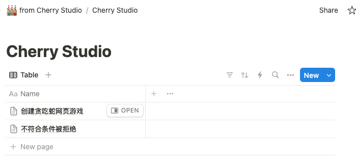
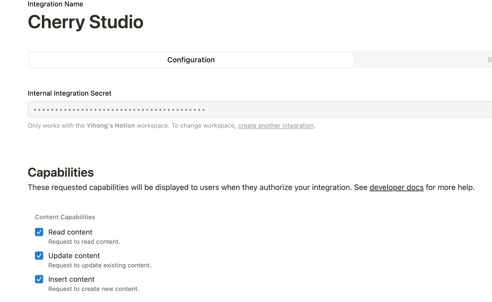
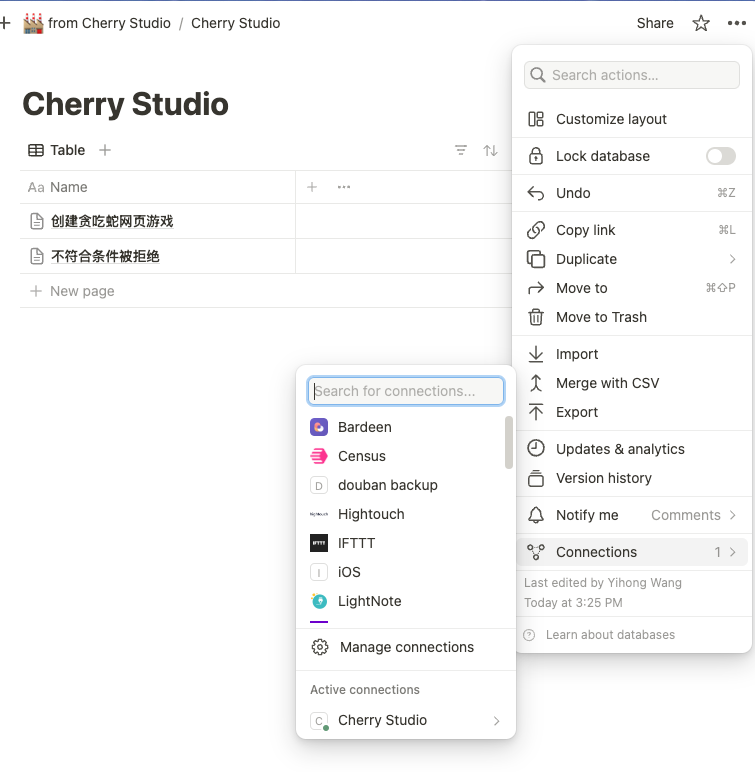
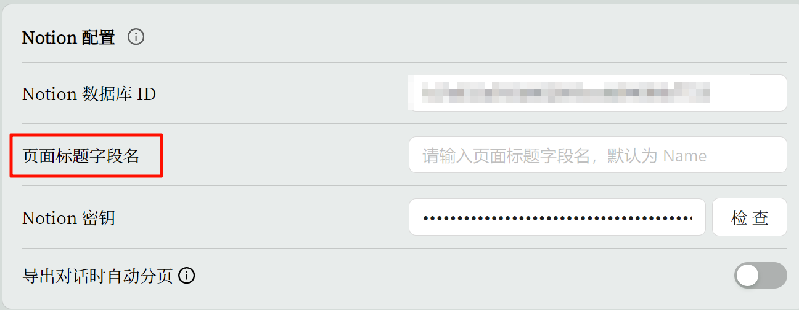
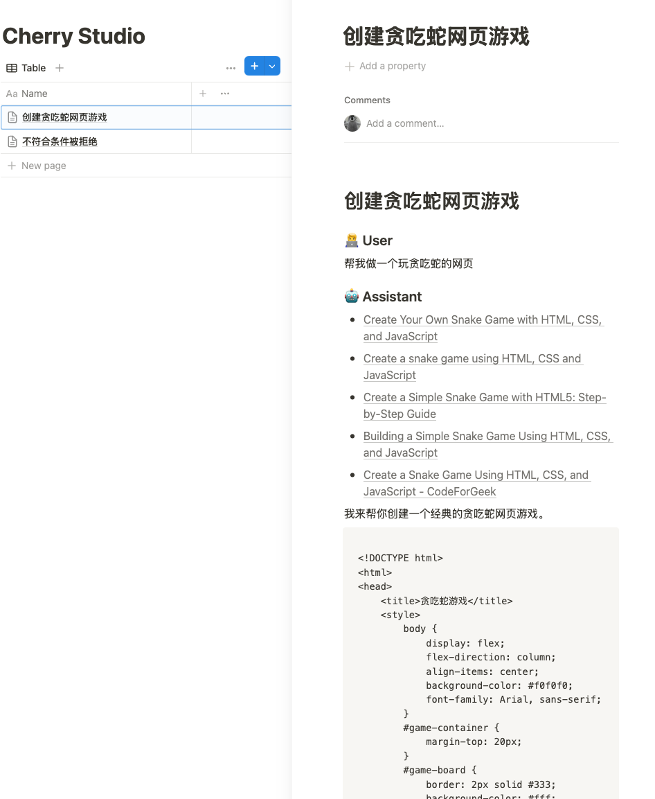

# Notion 配置教程

Cherry Studio 支持将话题导入 Notion 的数据库。

## 准备

首先你需要创建一个 Notion 数据库 及 [Notion Integration](https://www.notion.so/profile/integrations)，并将 Integration 连接至 Notion 数据库。如下图所示


注意：**数据库必须具备一个和设置中“页面标题字段名”相同的字段，默认是 Name，否则会导致导入失败**


<figure><figcaption></figcaption></figure>

<figure><figcaption></figcaption></figure>

<figure><figcaption></figcaption></figure>

接着需要在 Cherry Studio 中的配置 Notion 数据库ID 及 Notion 密钥：

如果你的 Notion 数据库的 URL 类似这样：

<mark style="color:blue;">https://www.notion.so/\<long\_hash\_1>?v=\<long\_hash\_2></mark>

那么 Notion 数据库 ID 就是 `<long_hash_1>` 这部分

注意这里的”页面标题字段名”需要和 Notion 数据库中的字段名**相同**，否则会导致导入失败。

<figure><figcaption></figcaption></figure>

## 使用

在话题中右键选择【导入到 Notion】

<figure><figcaption></figcaption></figure>

<figure><figcaption></figcaption></figure>
