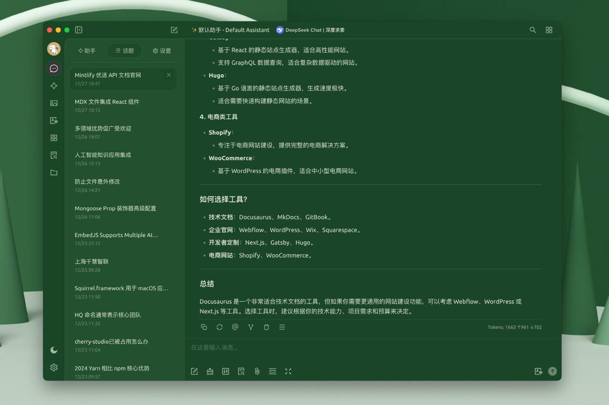

# 自定义CSS

通过自定义 CSS 可以修改软件的外观更加符合自己的喜好，例如这样：

<figure><figcaption><p>自定义 CSS</p></figcaption></figure>

```css
:root {
  --color-background: #1a462788;
  --color-background-soft: #1a4627aa;
  --color-background-mute: #1a462766;
  --navbar-background: #1a4627;
  --chat-background: #1a4627;
  --chat-background-user: #28b561;
  --chat-background-assistant: #1a462722;
}

#content-container {
  background-color: #2e5d3a !important;
}
```

### 内置变量

[https://github.com/CherryHQ/cherry-studio/tree/develop/src/renderer/src/assets/styles](https://github.com/CherryHQ/cherry-studio/tree/develop/src/renderer/src/assets/styles)

### 相关推荐

分享一些中国风 Cherry Studio 主题皮肤: [https://linux.do/t/topic/325119/95](https://linux.do/t/topic/325119/95)
