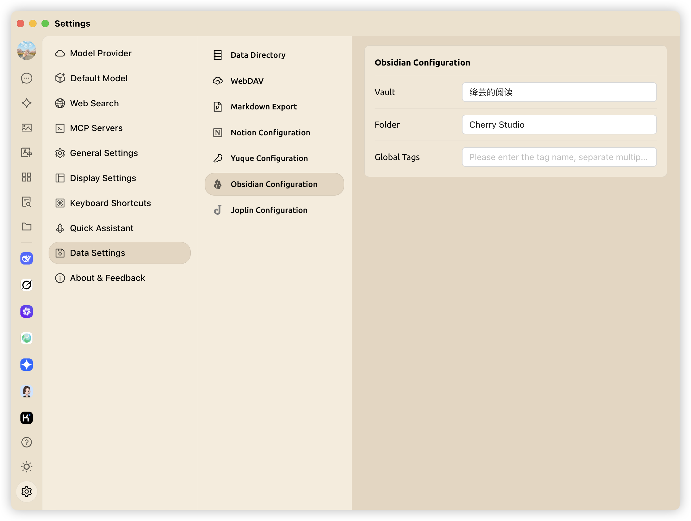

# Obsidian Configuration

Cherry Studio supports linking with Obsidian to export complete conversations or individual conversations to the Obsidian library.


No additional Obsidian plugins need to be installed for this process, but since Cherry Studio's import to Obsidian works on the same principle as the Obsidian Web Clipper, it is recommended that users upgrade to the latest version of Obsidian (the current Obsidian version should be at least greater than **1.7.2**) in order to avoid [import failures if the dialogue is too long.](https://github.com/obsidianmd/obsidian-clipper/releases/tag/0.7.0)


## Preparation of Obsidian

Open your Obsidian vault and create a `folder` to save the exported conversations (the "Cherry Studio" folder is used as an example in the image):

<figure><figcaption></figcaption></figure>

Pay attention to and remember the text framed in the bottom left corner; this is your `vault` name.

## Configuration of Cherry Studio

In the _Settings_ → _Data Settings_ → _Obsidian Configuration_ menu of Cherry Studio, enter the repository name and `folder` name that you obtained in [the first step](obsidian-configuration.md#preparation-of-obsidian):&#x20;

<figure><figcaption></figcaption></figure>

The `global tags` are optional and can be set for all dialogues exported to Obsidian. Fill in as needed.

## Exporting a Conversation

### Exporting Complete Conversation

Go back to the Cherry Studio conversation interface, right-click on the conversation, select _export_, and click _export to Obsidian_.

<figure><figcaption>
Export Complete Conversation
</figcaption></figure>

At this time, a window will pop up, used to adjust the **Properties** of this dialogue note exported to Obsidian, as well as the **processing method** for exporting to Obsidian. There are three optional **processing methods** for exporting to Obsidian:

* **Create new (overwrite if exists)**: Create a new conversation note in the `folder` filled in during [step two](obsidian-configuration.md#configuration-of-cherry-studio), overwriting the old note if a note with the same name exists.
* **Prepend**: When a note with the same name already exists, export the selected conversation content and add it to the beginning of that note.
* **Append**: Export and add selected dialog to the end of a note of the same name, if it already exists

<figure><figcaption>
Configure Note Properties
</figcaption></figure>


Only the first method will include Properties, the latter two methods will not.


### Exporting a Single Conversation

To export a single conversation, click the three-line menu below the conversation, select "Export," and then click "Export to Obsidian."

<figure><figcaption>
Exporting a Single Conversation
</figcaption></figure>

After that, the same window as when exporting the complete conversation will pop up, asking you to configure the note properties and how to handle the notes. Just follow [the tutorial above](obsidian-configuration.md#exporting-complete-conversation) to complete it.

## Export Success

🎉 By this point, congratulations on completing all the configurations for Cherry Studio linked Obsidian and walking through the export process in its entirety, ENJOY YOURSELVES!

<figure><figcaption>
Export Success to Obsidian
</figcaption></figure>

<figure><figcaption>
View Your Notes
</figcaption></figure>
