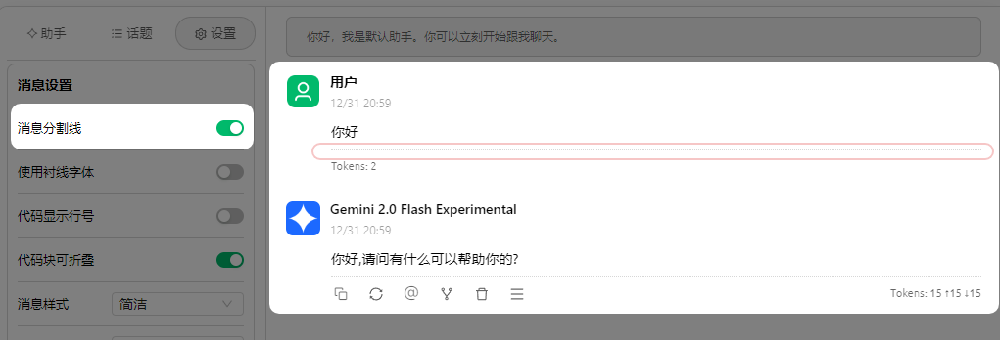
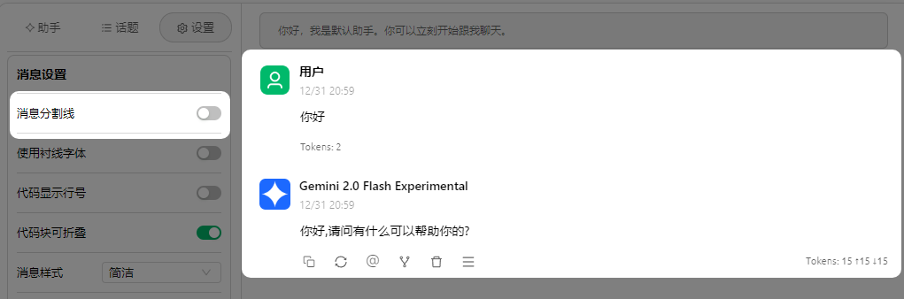

# Chat Interface

## Assistants and Topics

### Assistants

<mark style="background-color:yellow;">Assistants</mark> are used to personalize the settings of a selected model, such as preset prompts and parameter presets. These settings allow the chosen model to better meet your expected workflow.

<mark style="background-color:yellow;">`Default System Assistant`</mark> presets a relatively general parameter set (no prompt). You can use it directly or find the presets you need on the [Agents](https://app.gitbook.com/s/0Ut5BptC3t8CtSU1UWpM/cherrystudio/preview/agents) Page.

### Topics

<mark style="background-color:yellow;">Assistants</mark> are parent sets of <mark style="background-color:yellow;">Topics</mark>. Multiple topics (i.e., dialogues) can be created under a single assistant. All `topics` share the `assistant's` parameter settings and preset words (prompts), and other model settings.

<figure><figcaption></figcaption></figure>

<figure><figcaption></figcaption></figure>

## Chat Settings

<figure><figcaption></figcaption></figure>

### Model Settings

Model settings are synchronized with the `Settings` parameters in the assistant settings. See the Assistant Settings section of the documentation for details.


In dialogue settings, only the model settings apply to the current assistant, while other settings apply globally. For example, if you set the message style to bubble, it will be the bubble style under any topic of any assistant.


### Message Settings

<mark style="color:blue;">**`Message Separator Line`**</mark>**:**

Use a separator line to separate the message body from the operation bar.



<figure><figcaption></figcaption></figure>



<figure><figcaption></figcaption></figure>



<mark style="color:blue;">**`Use Serif Font`**</mark>**：**

Font style switching. You can now also change the font through Custom CSS.

<mark style="color:blue;">**`Show Line Numbers for Code`**</mark>**：**

Displays line numbers for code blocks when the model outputs code snippets.



<figure><figcaption></figcaption></figure>



<figure><figcaption></figcaption></figure>



<mark style="color:blue;">**`Collapsible Code Blocks`**</mark>**：**

When enabled, long code outputs within code snippets will be automatically collapsed.

<mark style="color:blue;">**`Message Style`**</mark>**：**

Allows switching the dialogue interface to bubble style or list style.

<mark style="color:blue;">**`Code Style`**</mark>**：**

Allows switching the display style of code snippets.

<mark style="color:blue;">**`Mathematical Formula Engine`**</mark>**：**

* KaTeX renders faster because it is specifically designed for performance optimization.
* MathJax renders slower but is more feature-rich and supports more mathematical symbols and commands.

<mark style="color:blue;">**`Message Font Size`**</mark>**：**

Adjust the font size of the dialogue interface.

### Input Settings

<mark style="color:blue;">**`Show Estimated Token Count`**</mark>**：**

Displays the estimated number of tokens consumed by the input text in the input box (not the actual tokens consumed by the context, for reference only).

<mark style="color:blue;">**`Paste Long Text as File`**</mark>**：**

When a long text is copied from elsewhere and pasted into the input box, it will automatically be displayed as a file style to reduce interference when entering subsequent content.

<mark style="color:blue;">**`Markdown Render Input Messages`**</mark>**：**

When turned off, only the messages replied by the model are rendered, and the sent messages are not rendered.



<figure><figcaption></figcaption></figure>



<figure><figcaption></figcaption></figure>



<mark style="color:blue;">**`Translate with 3 Quick Spacebar Taps`**</mark>**：**

After entering a message in the dialogue interface input box, quickly tapping the spacebar three times can translate the entered content into English.


Note: This operation will overwrite the original text.


***

## Assistant Settings

In the assistant interface, select the <mark style="background-color:yellow;">assistant name</mark> you need to set → select the corresponding setting in the <mark style="background-color:yellow;">right-click menu</mark>

#### Edit Assistant


Assistant settings apply to all topics under this assistant.


**Prompt Settings**

<mark style="color:blue;">**`Name`**</mark>**：**

You can customize an assistant name for easy identification.

<mark style="color:blue;">**`Prompt`**</mark>**：**

That is, the prompt. You can refer to the prompt writing on the agents page to edit the content.

### **Model Settings**

<mark style="color:blue;">**`Default Model`**</mark>**：**

You can fix a default model for this assistant. When adding from the agent page or copying an assistant, the initial model will be this model. If this item is not set, the initial model will be the global initial model (i.e., Default Assistant Model).


There are two types of default models for assistants: one is the Global Default Dialogue Model, and the other is the assistant's default model. The assistant's default model has a higher priority than the global default dialogue model. When the assistant's default model is not set, the assistant's default model = global default dialogue model.


<mark style="color:blue;">**`Auto Reset Model`**</mark>**：**

When turned on - when switching to use other models during use under this topic, creating a new topic will reset the new topic to the assistant's default model. When this item is turned off, the model of the new topic will follow the model used in the previous topic.

> For example, if the default model of the assistant is gpt-3.5-turbo, and I create topic 1 under this assistant, and switch to gpt-4o during the dialogue in topic 1, then:
>
> If auto-reset is turned on: When creating a new topic 2, the default model selected for topic 2 is gpt-3.5-turbo;
>
> If auto-reset is turned off: When creating a new topic 2, the default model selected for topic 2 is gpt-4o.

<mark style="color:blue;">**`Temperature`**</mark>**&#x20;：**

The temperature parameter controls the randomness and creativity of the text generated by the model (default value is 0.7). Specifically:

* Low temperature value (0-0.3):
  * Output is more deterministic and focused
  * Suitable for code generation, data analysis and other scenarios requiring accuracy
  * Tends to choose the most probable words for output
* Medium temperature value (0.4-0.7):
  * Balances creativity and coherence
  * Suitable for daily conversations, general writing
  * Recommended for chatbot dialogues (around 0.5)
* High temperature value (0.8-1.0):
  * Produces more creative and diverse output
  * Suitable for creative writing, brainstorming and other scenarios
  * But may reduce the coherence of the text

<mark style="color:blue;">**`Top P (Nucleus Sampling)`**</mark>**：**

The default value is 1. The smaller the value, the more monotonous and easier to understand the content generated by AI; the larger the value, the wider the range of vocabulary the AI replies with, and the more diversified it is.

Nucleus sampling affects the output by controlling the probability threshold for vocabulary selection:

* Smaller value (0.1-0.3):
  * Only consider the highest probability vocabulary
  * Output is more conservative and controllable
  * Suitable for code comments, technical documentation and other scenarios
* Medium value (0.4-0.6):
  * Balances vocabulary diversity and accuracy
  * Suitable for general conversation and writing tasks
* Larger value (0.7-1.0):
  * Consider a wider range of vocabulary choices
  * Produces richer and more diverse content
  * Suitable for creative writing and other scenarios requiring diversified expression


- These two parameters can be used independently or in combination.
- Choose appropriate parameter values according to the specific task type.
- It is recommended to find the parameter combination that best suits specific application scenarios through experiments.
- The above content is for reference and conceptual understanding only, and the given parameter range may not be suitable for all models. Please refer to the parameter recommendations given in the relevant model documentation.


<mark style="color:blue;">**`Context Window`**</mark>

The number of messages to keep in the context. The larger the value, the longer the context and the more tokens consumed:

* 5-10: Suitable for normal conversations
* \>10: Complex tasks requiring longer memory (e.g., tasks that generate long articles step-by-step according to a writing outline, which requires ensuring coherent context logic)
* > Note: The more messages, the more tokens are consumed.

<mark style="color:blue;">**`Enable Message Length Limit (MaxToken)`**</mark>

Maximum number of [Tokens](https://docs.cherry-ai.com/question-contact/knowledge#shen-me-shi-tokens) for a single response. In large language models, max token (maximum number of tokens) is a key parameter that directly affects the quality and length of the model's generated responses. The specific setting depends on your needs, and you can also refer to the following suggestions.

> For example: When testing whether the model is connected after filling in the key in CherryStudio, you only need to know whether the model returns messages correctly without specific content. In this case, set MaxToken to 1.

The MaxToken limit for most models is 4k Tokens, and of course there are also 2k, 16k or even more. You need to check the corresponding introduction page for details.


Suggestions:

* General chat: 500-800
* Short article generation: 800-2000
* Code generation: 2000-3600
* Long article generation: 4000 and above (requires model support)



In general, the model's generated responses will be limited to the MaxToken range. Of course, there may also be truncation (such as when writing long code) or incomplete expressions. In special cases, you also need to flexibly adjust according to the actual situation.


<mark style="color:blue;">**`Stream Output`**</mark>

Stream output is a data processing method that allows data to be transmitted and processed in a continuous stream form, instead of sending all data at once. This method allows data to be processed and output immediately after it is generated, greatly improving real-time performance and efficiency.

In CherryStudio client and similar environments, it is simply a typewriter effect.

When turned off (non-stream): The model outputs the entire paragraph of information at once after generation (imagine the feeling of receiving a message on WeChat);

When turned on: Output word by word. It can be understood that the large model sends you each word as soon as it generates it, until all words are sent.


If some special models do not support stream output, you need to turn off this switch, such as o1-mini, which **initially** only supported non-stream output.


<mark style="color:blue;">**`Custom Parameters`**</mark>

Add extra request parameters to the request body (body), such as fields like `presence_penalty`. Generally, most people will not need to use this.

How to fill in: Parameter Name - Parameter Type (Text, Number, etc.) - Value. Reference documentation: [Click to go](https://openai.apifox.cn/doc-3222739)

> The above parameters such as top-p, maxtokens, stream are among these parameters.


Custom parameters have higher priority than built-in parameters. That is, if custom parameters are duplicated with built-in parameters, the custom parameters will override the built-in parameters.

For example: After setting `model` to `gpt-4o` in custom parameters, no matter which model is selected in the dialogue, the `gpt-4o` model is used.

