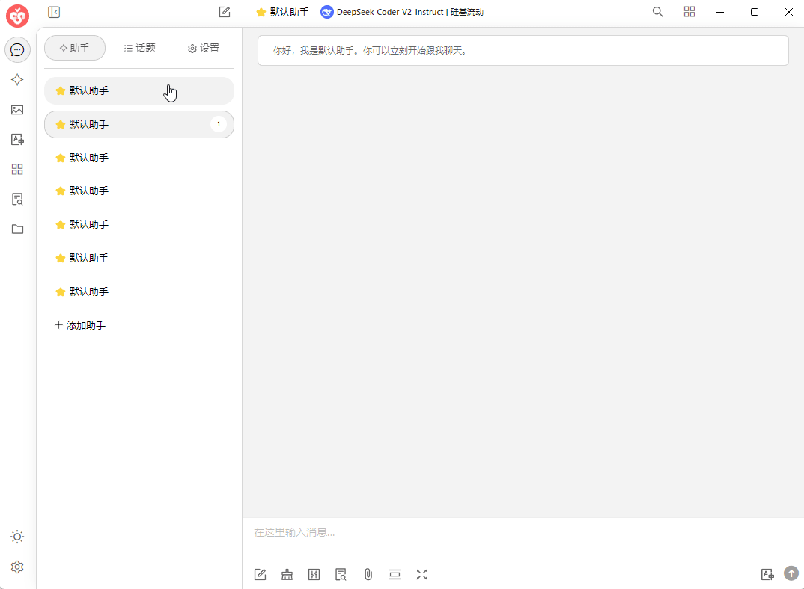

# Display Settings

On this page, you can set the software's color theme, page layout, or customize CSS for personalized settings.

## Theme Selection

You can set the default interface color mode here (Light Mode, Dark Mode, or Follow System).

## Topic Settings

This setting is for the layout of the conversation interface.

**Topic Layout**



<figure><figcaption></figcaption></figure>



<figure><figcaption></figcaption></figure>



## **Automatically Switch to Topic**

When this setting is enabled, clicking on the assistant name will automatically switch to the corresponding topic page.



<figure><figcaption></figcaption></figure>



<figure><figcaption></figcaption></figure>



## Display Topic Time

When enabled, it will display the topic <mark style="color:blue;">creation</mark> time below the topic title.



<figure><figcaption></figcaption></figure>



<figure><figcaption></figcaption></figure>



## Custom CSS

Through this setting, you can flexibly make personalized changes and settings to the interface. For specific methods, refer to the Personalization Settings in the advanced tutorials.
