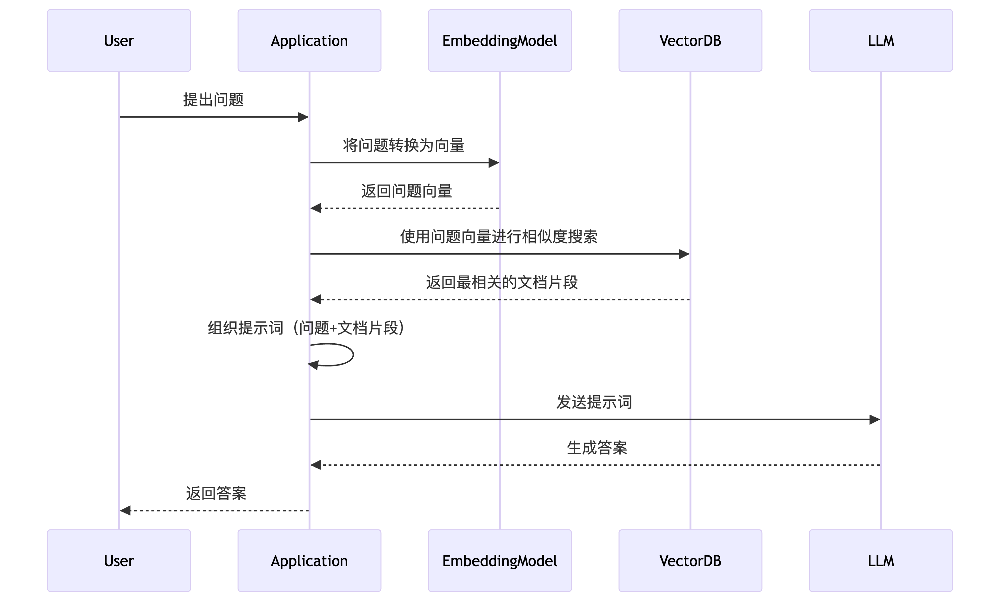

# Knowledge Base Data

All data added to the Knowledge Base in Cherry Studio is stored locally. During the adding process, a copy of the document will be placed in the Cherry Studio data storage directory.

<figure><figcaption></figcaption></figure>

Vector Database: [https://turso.tech/libsql](https://turso.tech/libsql)

After a document is added to the Cherry Studio Knowledge Base, the file will be split into several fragments. These fragments will then be processed by the embedding model.

When using a large model for question answering, text fragments related to the question will be queried and passed to the large language model for processing together.

If you have data privacy requirements, it is recommended to use a local embedding database and a local large language model.
