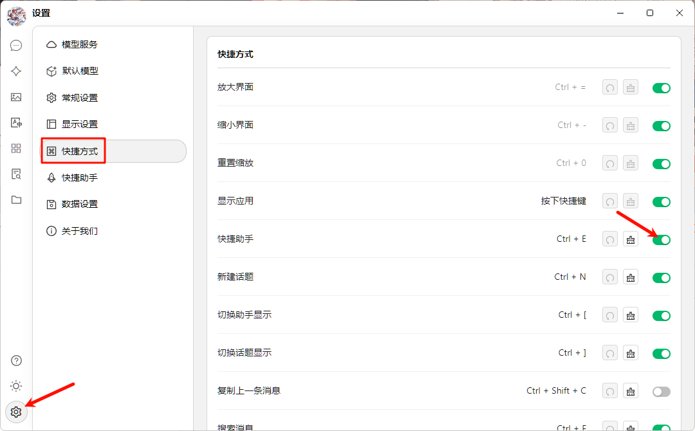
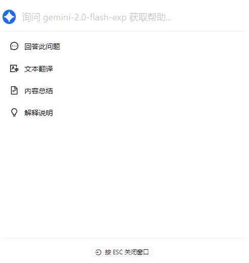

# Quick Assistant

**Quick Assistant** is a convenient tool provided by Cherry Studio that allows you to quickly access AI functions in any application, enabling instant operations such as asking questions, translating, summarizing, and explaining.

### Enable Quick Assistant

1. **Open Settings:** Navigate to `Settings` -> `Quick Assistant`.
2. **Turn on the switch:** Find and click the "Quick Assistant" enable button.

<figure><figcaption></figcaption></figure>

1. **Set Shortcut Key (Optional):**
   * The default shortcut key is <kbd>Ctrl</kbd>+ <kbd>E</kbd>.
   * You can customize the shortcut key here to avoid conflicts or to better fit your usage habits.

### Using Quick Assistant

1. **Activate:** In any application, press your set shortcut key (default <kbd>Ctrl</kbd> + <kbd>E</kbd>) to open Quick Assistant.
2.  **Interact:** In the Quick Assistant window, you can directly perform the following operations:

    * **Ask a Question:** Ask the AI any question.
    * **Text Translation:** Enter the text to be translated.
    * **Summarize Content:** Enter long text to summarize.
    * **Explanation:** Enter the concept or term to be explained.

    <figure><figcaption></figcaption></figure>
3. **Close:** Press the <kbd>ESC</kbd> key or click anywhere outside the Quick Assistant window to close it.

### Set Default Model

You can specify a default AI model for Quick Assistant to get a more consistent and personalized experience.

1. **Open Settings:** Navigate to `Settings` -> `Default Model` -> `Default Assistant Model`.

<figure><figcaption></figcaption></figure>

1. **Select Model:** Select the model you want to use from the dropdown list.

### Tips and Tricks

* **Shortcut Key Conflicts:** If the default shortcut key conflicts with other applications, please change the shortcut key.
* **Explore More Features:** In addition to the features mentioned in the documentation, Quick Assistant may also support other operations, such as code generation, style transfer, etc. We encourage you to explore further as you use it.
* **Feedback and Improvement:** If you encounter any problems or have any suggestions for improvement during use, please give feedback to the Cherry Studio team feedback.
