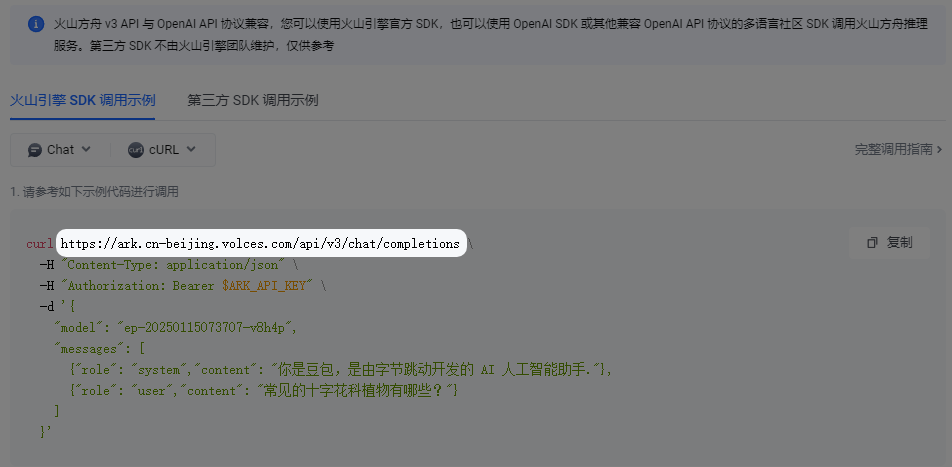

# 常见问题

## 常见错误代码

| 错误码 | 可能得情况                 | 解决方法                                                                                                     |
| --- | --------------------- | -------------------------------------------------------------------------------------------------------- |
| 400 | 请求体格式错误等              | 查看对话返回的错误内容或[控制台](questions.md#kong-zhi-tai-bao-cuo-cha-kan-fang-fa)查看报错内容，根据提示操作，如果是gemini模型，可能需要进行绑卡操作 |
| 401 | 认证失败：模型不被支持或服务端账户被封禁等 | 联系或查看对应服务商账户状态                                                                                           |
| 403 | 请求操作无权限               | 根据对话返回的错误信息或[控制台](questions.md#kong-zhi-tai-bao-cuo-cha-kan-fang-fa)错误信息提示进行相应操作                         |

## 控制台报错查看方法

* 点击CherryStudio客户端窗口后按下快捷键`Ctrl`+`Shift`+`I`（Mac端：`Command`+`Option`+`I`）


- 当前活动窗口必须为CherryStudio的客户端窗口才能调出控制台;
- 需要先打开控制台，再点击测试或者发起对话等请求才能收集到请求信息。


* 在弹出的控制台窗口中点击<mark style="color:blue;">`Network`</mark> → 点击查看②处最后一个标有红色 <mark style="color:red;">`×`</mark>  的<mark style="color:red;">`completions`</mark>请求 → 点击<mark style="color:blue;">`Response`</mark>查看完整的返回内容（图中④的区域）。

> 如果你无法判断该错误的原因,请将该界面截图发送到[官方交流群](https://t.me/CherryStudioAI)中寻求帮助。

<figure><figcaption></figcaption></figure>

